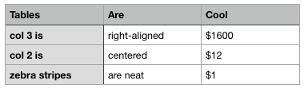

# XLSX 2 JSON API

A light weight API that converts XLSX files into JSON.

It will turn...



...into...

```json
{
  "name" : "tables are cool.xlsx",
  "spreadsheets" : [
    {
      "name" : "Sheet 1",
      "columns" : [
        "Tables",
        "Are",
        "Cool"
      ],
      "rows" : [
        [
          "col 3 is",
          "right-aligned",
          "$1600"
        ],
        [
          "col 2 is",
          "centered",
          "$12"
        ],
        [
          "zebra stripes",
          "are neat",
          "$1"
        ]
      ]
    }
  ]
}
```

...and vice versa.

Simply send an XLSX file via `POST` and `multipart/form-data` request to `/`. Expected upload parameter name is `file`.

**Sample form**

```html
<!DOCTYPE html>
<html lang="en">
<head>
    <meta charset="UTF-8">
    <title>XSLX2JSON API</title>
</head>
<body>
<h1>XSLX to JSON to XLSX REST API</h1>
<form action="/" method="post" enctype="multipart/form-data">
    <input type="file" name="file" accept="application/vnd.openxmlformats-officedocument.spreadsheetml.sheet,application/json">
    <button type="submit">Upload</button>
</form>
</body>
</html>
```

## Endpoints

### `POST /`

This either accepts an XLSX file or JSON file as part of a `multipart/form-data` request.

**Sample XLSX upload**

```
POST http://localhost:8000
Content-Type: multipart/form-data
-----------------------------1234567890
Content-Disposition: form-data; name="file"; filename="test.xlsx"
Content-Type: application/vnd.openxmlformats-officedocument.spreadsheetml.sheet

...
```

### `POST /json2xlsx`

This endpoint accepts JSON if sent via `POST` and with `Content-Type: application/json`

```
POST http://localhost:8000/json2xlsx
Accept: */*
Cache-Control: no-cache
Content-Type: application/json

{}
```

The format has to match the format that is returned by turning XLSX to JSON.


## Environment variables

* `API_HOST` (default `localhost`)
* `API_PORT` (default `8000`)
* `DEBUG` (default `0`), use `DEBUG=1` to enable debug mode

## Test & build

```bash
go test && go build
```